# UCM (Unified Communication Memory) Usage

UCM intercepts memory allocation/deallocation events to maintain a memory registration cache, which is crucial for RDMA performance.

## Purpose of UCM

**Problem**: RDMA operations require memory to be registered with the hardware, which is expensive:
- Registration latency: ~10-100 microseconds per operation
- Deregistration must happen before memory is freed
- Dynamic memory allocations/deallocations would be too slow

**Solution**: UCM provides:
1. **Memory event interception** - hooks into malloc/free/mmap/munmap
2. **Registration cache** - keeps track of registered memory regions
3. **Automatic cleanup** - deregisters memory when it's being freed

## UCM Architecture

### Memory Event Hooks
UCM intercepts these functions:
- `malloc()`, `free()`, `realloc()`, `calloc()`
- `mmap()`, `munmap()`, `mremap()`
- `sbrk()`, `brk()`
- `madvise()`, `CUDA/ROCm allocators`

### Components
- **Event handlers** - callbacks when memory events occur
- **Bistro** - binary instrumentation for function interception
- **Registration cache** - tracks registered memory regions

## Example 1: Basic Memory Registration Cache

```c
#include <ucs/memory/rcache.h>
#include <ucm/api/ucm.h>

// Application allocates memory normally
void* app_buffer = malloc(1024 * 1024); // 1MB buffer

// UCX registers memory for RDMA (internally uses UCM)
uct_md_mem_reg(md, app_buffer, 1024 * 1024, UCT_MD_MEM_ACCESS_ALL, &memh);

// First registration: expensive (~50us)
// - UCM hooks detect no previous registration
// - Memory is registered with hardware
// - Entry added to registration cache

// ... do RDMA operations ...

// Later: application frees and reallocates
free(app_buffer);
// UCM hook triggered:
// - Checks if memory was registered
// - Deregisters from hardware
// - Removes from cache

app_buffer = malloc(1024 * 1024); // Same or overlapping address

// Second registration: much faster (~1us)
uct_md_mem_reg(md, app_buffer, 1024 * 1024, UCT_MD_MEM_ACCESS_ALL, &memh);
// - UCM cache hit (if addresses overlap)
// - No hardware registration needed
// - Return cached registration
```

## Example 2: UCM Event Handler Registration

Located in: `src/ucm/event/event.c`

```c
#include <ucm/api/ucm.h>

// Custom memory event handler
void my_memory_event_handler(ucm_event_type_t event_type,
                            ucm_event_t *event, void *arg)
{
    switch (event_type) {
    case UCM_EVENT_VM_MAPPED:
        printf("Memory mapped: addr=%p, size=%zu\n", 
               event->vm_mapped.address, event->vm_mapped.size);
        // Register with RDMA hardware if needed
        break;
        
    case UCM_EVENT_VM_UNMAPPED:
        printf("Memory unmapped: addr=%p, size=%zu\n",
               event->vm_unmapped.address, event->vm_unmapped.size);
        // Deregister from RDMA hardware
        break;
        
    case UCM_EVENT_MEM_TYPE_ALLOC:
        printf("GPU memory allocated: addr=%p, size=%zu, mem_type=%d\n",
               event->mem_type.address, event->mem_type.size,
               event->mem_type.mem_type);
        break;
        
    case UCM_EVENT_MEM_TYPE_FREE:
        printf("GPU memory freed: addr=%p, mem_type=%d\n",
               event->mem_type.address, event->mem_type.mem_type);
        break;
    }
}

// Register the event handler
ucm_set_event_handler(UCM_EVENT_VM_MAPPED | UCM_EVENT_VM_UNMAPPED |
                      UCM_EVENT_MEM_TYPE_ALLOC | UCM_EVENT_MEM_TYPE_FREE,
                      0, my_memory_event_handler, NULL);
```

## Example 3: Registration Cache Implementation

Located in: `src/ucs/memory/rcache.c`

```c
// Memory registration cache entry
typedef struct ucs_rcache_region {
    ucs_list_link_t     super;
    void               *address;     // Memory address
    size_t             size;         // Region size
    uint64_t           flags;        // Access flags
    uct_mem_h          memh;         // Hardware memory handle
    unsigned           refcount;     // Reference count
    ucs_time_t         last_used;    // LRU timestamp
} ucs_rcache_region_t;

// Registration cache operations
static ucs_status_t rcache_mem_reg(ucs_rcache_t *rcache, void *address,
                                  size_t length, uint64_t flags,
                                  ucs_rcache_region_t **region_p)
{
    ucs_rcache_region_t *region;
    ucs_status_t status;
    
    // 1. Check if memory is already registered
    region = ucs_rcache_lookup(rcache, address, length, flags);
    if (region != NULL) {
        // Cache hit - return existing registration
        ucs_rcache_region_hold(region);
        *region_p = region;
        return UCS_OK;
    }
    
    // 2. Cache miss - need to register
    region = ucs_malloc(sizeof(*region), "rcache_region");
    if (region == NULL) {
        return UCS_ERR_NO_MEMORY;
    }
    
    // 3. Register with hardware
    status = uct_md_mem_reg(rcache->md, address, length, flags, &region->memh);
    if (status != UCS_OK) {
        ucs_free(region);
        return status;
    }
    
    // 4. Add to cache
    region->address = address;
    region->size = length;
    region->flags = flags;
    region->refcount = 1;
    region->last_used = ucs_get_time();
    
    ucs_rcache_insert(rcache, region);
    *region_p = region;
    
    return UCS_OK;
}
```

## Example 4: UCM Hook Installation

Located in: `src/ucm/malloc/malloc_hook.c`

```c
#include <ucm/malloc/malloc_hook.h>

// Original function pointers
static void* (*orig_malloc)(size_t size) = NULL;
static void (*orig_free)(void *ptr) = NULL;

// Hooked malloc function
void* ucm_malloc(size_t size)
{
    void *ptr;
    ucm_event_t event;
    
    // Call original malloc
    ptr = orig_malloc(size);
    if (ptr == NULL) {
        return NULL;
    }
    
    // Notify UCM about allocation
    event.vm_mapped.address = ptr;
    event.vm_mapped.size = size;
    ucm_dispatch_vm_mapped(&event);
    
    return ptr;
}

// Hooked free function  
void ucm_free(void *ptr)
{
    ucm_event_t event;
    size_t size;
    
    if (ptr == NULL) {
        return;
    }
    
    // Get allocation size (implementation specific)
    size = ucm_get_allocation_size(ptr);
    
    // Notify UCM about deallocation
    event.vm_unmapped.address = ptr;
    event.vm_unmapped.size = size;
    ucm_dispatch_vm_unmapped(&event);
    
    // Call original free
    orig_free(ptr);
}

// Install hooks using binary instrumentation
ucs_status_t ucm_malloc_install_hooks()
{
    ucs_status_t status;
    
    // Save original function pointers
    orig_malloc = malloc;
    orig_free = free;
    
    // Replace with hooked versions using bistro
    status = ucm_bistro_patch(malloc, ucm_malloc);
    if (status != UCS_OK) {
        return status;
    }
    
    status = ucm_bistro_patch(free, ucm_free);
    if (status != UCS_OK) {
        ucm_bistro_restore(malloc);
        return status;
    }
    
    return UCS_OK;
}
```

## Example 5: CUDA Memory Integration

Located in: `src/ucm/cuda/cudamem.c`

```c
#include <ucm/cuda/cudamem.h>
#include <cuda_runtime.h>

// Hooked CUDA functions
static cudaError_t (*orig_cudaMalloc)(void **ptr, size_t size) = NULL;
static cudaError_t (*orig_cudaFree)(void *ptr) = NULL;

cudaError_t ucm_cudaMalloc(void **ptr, size_t size)
{
    cudaError_t ret;
    ucm_event_t event;
    
    // Call original cudaMalloc
    ret = orig_cudaMalloc(ptr, size);
    if (ret != cudaSuccess) {
        return ret;
    }
    
    // Notify UCM about CUDA allocation
    event.mem_type.address = *ptr;
    event.mem_type.size = size;
    event.mem_type.mem_type = UCS_MEMORY_TYPE_CUDA;
    ucm_dispatch_mem_type_alloc(&event);
    
    return ret;
}

cudaError_t ucm_cudaFree(void *ptr)
{
    ucm_event_t event;
    cudaError_t ret;
    
    if (ptr == NULL) {
        return cudaSuccess;
    }
    
    // Notify UCM about CUDA deallocation
    event.mem_type.address = ptr;
    event.mem_type.mem_type = UCS_MEMORY_TYPE_CUDA;
    ucm_dispatch_mem_type_free(&event);
    
    // Call original cudaFree
    ret = orig_cudaFree(ptr);
    return ret;
}
```

## UCM Event Flow Diagram

```mermaid
sequenceDiagram
    participant App as Application
    participant UCM as UCM Hook
    participant Cache as Registration Cache
    participant HW as RDMA Hardware

    App->>UCM: malloc(1MB)
    UCM->>UCM: Call original malloc()
    UCM->>Cache: Notify VM_MAPPED event
    Cache->>Cache: Record memory region
    UCM-->>App: Return allocated pointer

    Note over App, HW: Later: UCX needs to register memory

    App->>Cache: uct_md_mem_reg(ptr, 1MB, flags)
    Cache->>Cache: Check if already registered
    
    alt Cache Miss
        Cache->>HW: Register memory with hardware
        HW-->>Cache: Return memory handle
        Cache->>Cache: Store in cache
    else Cache Hit
        Cache->>Cache: Return cached handle
    end
    
    Cache-->>App: Return registration handle

    Note over App, HW: Later: Application frees memory

    App->>UCM: free(ptr)
    UCM->>Cache: Notify VM_UNMAPPED event
    Cache->>HW: Deregister from hardware
    HW-->>Cache: Acknowledge deregistration
    Cache->>Cache: Remove from cache
    UCM->>UCM: Call original free()
    UCM-->>App: Return
```



## Performance Benefits

### Without UCM:
```c
// Expensive path (every operation ~50us)
for (int i = 0; i < 1000; i++) {
    void *buf = malloc(4096);
    uct_md_mem_reg(md, buf, 4096, flags, &memh);  // ~50us
    // ... RDMA operations ...
    uct_md_mem_dereg(md, memh);                   // ~10us  
    free(buf);
}
// Total: ~60ms for registrations
```

### With UCM:
```c
// Fast path (cached registrations ~1us)
for (int i = 0; i < 1000; i++) {
    void *buf = malloc(4096);                     // UCM hook
    uct_md_mem_reg(md, buf, 4096, flags, &memh); // ~1us (cached)
    // ... RDMA operations ...
    uct_md_mem_dereg(md, memh);                   // ~1us (cached)
    free(buf);                                    // UCM hook
}
// Total: ~2ms for registrations (30x faster!)
```

## Key Features

1. **Automatic**: No application code changes needed
2. **Transparent**: Works with any memory allocation pattern
3. **Efficient**: Significant performance improvement for dynamic allocations
4. **Memory Types**: Supports host, CUDA, ROCm, and other memory types
5. **Thread Safe**: Handles multi-threaded applications correctly

UCM is essential for UCX performance when applications use dynamic memory allocation patterns with RDMA operations.