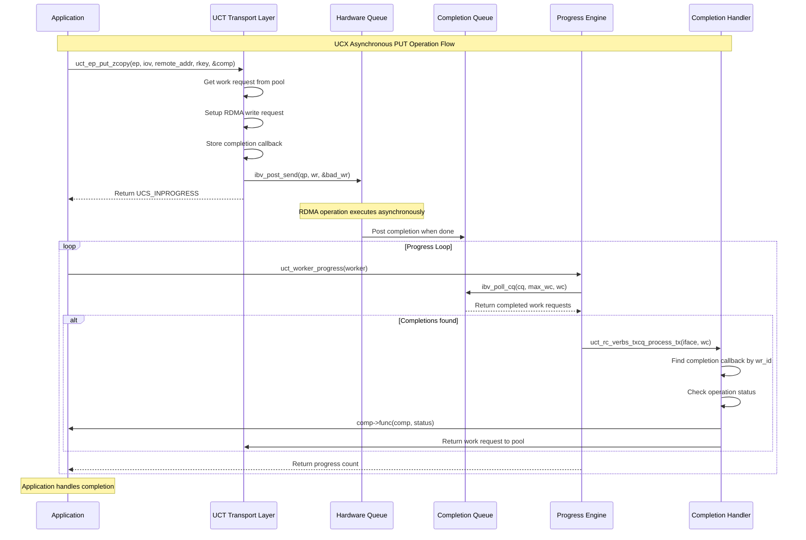
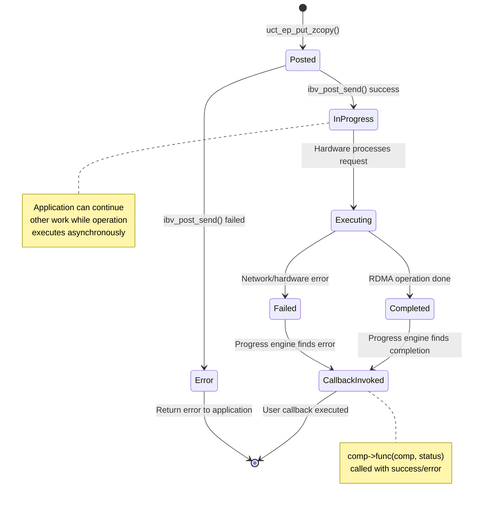

# UCX Asynchronous Call Flow

This document explains how asynchronous operations work in UCX at the UCT (transport) layer, using `uct_ep_put_zcopy()` as an example.

## Overview

UCX implements asynchronous operations through a progress-driven model where:
1. Operations are posted to hardware queues
2. A progress engine polls for completions 
3. User callbacks are invoked when operations complete

## Call Flow Example: uct_ep_put_zcopy()

### 1. Initial Async Call

```c
ucs_status_t status = uct_ep_put_zcopy(ep, iov, iovcnt, remote_addr, rkey, &comp);
```

**Possible Return Values:**
- `UCS_OK` - Completed immediately (rare)
- `UCS_INPROGRESS` - Async operation posted 
- `UCS_ERR_NO_RESOURCE` - Retry later
- Other errors

### 2. Transport Implementation (RC Verbs Example)

Located in: `src/uct/ib/rc/verbs/rc_verbs_ep.c`

```c
ucs_status_t uct_rc_verbs_ep_put_zcopy(uct_ep_h tl_ep, const uct_iov_t *iov,
                                       size_t iovcnt, uint64_t remote_addr,
                                       uct_rkey_t rkey, uct_completion_t *comp)
{
    // 1. Get work request from pool
    struct ibv_send_wr *wr = uct_rc_verbs_ep_get_send_wr(ep);
    
    // 2. Setup RDMA write work request
    wr->opcode = IBV_WR_RDMA_WRITE;
    wr->wr.rdma.remote_addr = remote_addr;
    wr->wr.rdma.rkey = rkey;
    wr->sg_list = setup_scatter_gather(iov, iovcnt);
    wr->send_flags = IBV_SEND_SIGNALED; // Request completion
    
    // 3. Store completion callback
    uct_rc_txqp_add_send_comp(&ep->super.txqp, comp, wr->wr_id);
    
    // 4. Post to hardware queue
    int ret = ibv_post_send(ep->qp, wr, &bad_wr);
    if (ret) {
        return UCS_ERR_IO_ERROR;
    }
    
    return UCS_INPROGRESS; // Operation posted, will complete later
}
```

**Key Steps:**
1. **Resource Allocation**: Get work request from pre-allocated pool
2. **Setup**: Configure RDMA work request with target address and data
3. **Callback Storage**: Associate user completion callback with operation
4. **Hardware Posting**: Submit to InfiniBand queue pair for execution
5. **Return Status**: Return `UCS_INPROGRESS` to indicate async operation

### 3. Progress Engine Called

Application or UCX internal code calls:
```c
unsigned progress_count = uct_worker_progress(worker);
```

Implementation in: `src/uct/ib/rc/verbs/rc_verbs_iface.c`

```c
unsigned uct_rc_verbs_iface_progress(uct_iface_h tl_iface)
{
    uct_rc_verbs_iface_t *iface = ucs_derived_of(tl_iface, uct_rc_verbs_iface_t);
    struct ibv_wc wc[UCT_IB_MAX_WC];
    unsigned count = 0;
    
    // 1. Poll completion queue
    int ne = ibv_poll_cq(iface->super.super.cq[UCT_IB_DIR_TX], UCT_IB_MAX_WC, wc);
    
    for (int i = 0; i < ne; ++i) {
        // 2. Process each completion
        uct_rc_verbs_txcq_process_tx(iface, &wc[i]);
        count++;
    }
    
    return count;
}
```

**Key Steps:**
1. **Poll Hardware**: Check completion queue for finished operations
2. **Process Completions**: Handle each completed operation
3. **Return Count**: Number of operations processed

### 4. Completion Processing

```c
void uct_rc_verbs_txcq_process_tx(uct_rc_verbs_iface_t *iface, struct ibv_wc *wc)
{
    uct_rc_txqp_t *txqp;
    uct_completion_t *comp;
    
    // 1. Find the endpoint and completion from work completion ID
    txqp = uct_rc_verbs_txqp_find(iface, wc->wr_id);
    comp = uct_rc_txqp_get_comp(txqp, wc->wr_id);
    
    // 2. Check for errors
    if (wc->status != IBV_WC_SUCCESS) {
        ucs_error("RDMA operation failed: %s", ibv_wc_status_str(wc->status));
        comp->status = UCS_ERR_IO_ERROR;
    } else {
        comp->status = UCS_OK;
    }
    
    // 3. Invoke user callback
    if (comp->func != NULL) {
        comp->func(comp, comp->status);
    }
    
    // 4. Return work request to pool
    uct_rc_verbs_ep_put_send_wr(ep, wr);
}
```

**Key Steps:**
1. **Lookup**: Find completion callback using work request ID
2. **Status Check**: Determine if operation succeeded or failed
3. **Callback Invocation**: Call user-provided completion function
4. **Resource Cleanup**: Return work request to pool for reuse

### 5. User Callback Execution

The user-provided completion callback is invoked:

```c
void my_put_completion(uct_completion_t *comp, ucs_status_t status)
{
    if (status == UCS_OK) {
        printf("PUT operation completed successfully\n");
        // Update application state
        my_app_data->put_completed = 1;
    } else {
        printf("PUT operation failed: %s\n", ucs_status_string(status));
        // Handle error
    }
}
```

## Complete Flow Diagram

### Text Diagram
```
Application Code
    ↓ uct_ep_put_zcopy(ep, iov, remote_addr, rkey, &comp)
Transport Layer (RC Verbs)
    ↓ Setup work request, store completion, post to HW
    ↓ Return UCS_INPROGRESS
Hardware Queue
    ↓ RDMA operation executes on network
    ↓ Completion posted to completion queue
Progress Engine
    ↓ uct_worker_progress() called
    ↓ Poll completion queue (ibv_poll_cq)
    ↓ Process completions
Completion Handler
    ↓ Extract completion callback
    ↓ Check status, invoke user callback
User Callback
    ↓ Handle completion (success/error)
```

### Mermaid Sequence Diagram



### Mermaid State Diagram



## Key Data Structures

### uct_completion_t
```c
typedef struct uct_completion {
    uct_completion_callback_t func;    // User callback function
    ucs_status_t              status;  // Operation status
    int                       count;   // Reference count
} uct_completion_t;
```

### Work Request (InfiniBand)
```c
struct ibv_send_wr {
    uint64_t                wr_id;      // Work request identifier
    struct ibv_send_wr     *next;       // Next request in chain
    struct ibv_sge         *sg_list;    // Scatter-gather list
    int                     num_sge;    // Number of SGEs
    enum ibv_wr_opcode      opcode;     // Operation type (RDMA_WRITE, etc.)
    int                     send_flags; // Flags (signaled, inline, etc.)
    // Union for operation-specific fields
    union {
        struct {
            uint64_t        remote_addr;
            uint32_t        rkey;
        } rdma;
    } wr;
};
```

## Performance Characteristics

### Benefits of Asynchronous Model
1. **Overlap**: Computation can overlap with communication
2. **Pipelining**: Multiple operations can be in flight simultaneously
3. **Efficiency**: Hardware queues enable batching and optimization
4. **Scalability**: Non-blocking operations prevent thread blocking

### Progress Engine Considerations
1. **Polling vs Events**: Progress can be driven by polling or event notifications
2. **Frequency**: More frequent progress calls = lower latency, higher CPU usage
3. **Batching**: Processing multiple completions per progress call improves efficiency

## Transport Variations

Different transports implement async operations differently:

- **InfiniBand/RoCE**: Uses verbs work queues and completion queues
- **TCP**: Uses socket polling with epoll/kqueue
- **Shared Memory**: Uses memory-based signaling mechanisms
- **GPU**: Uses CUDA/ROCm streams and events

## Error Handling

Async operations can fail at multiple stages:
1. **Posting**: Resource exhaustion, invalid parameters
2. **Execution**: Network errors, remote failures
3. **Completion**: Timeout, connection loss

Each stage requires appropriate error handling and recovery mechanisms.

## Summary

UCX's asynchronous operation model provides high performance through:
- **Non-blocking operations** that return immediately
- **Progress-driven completion** handling
- **Callback-based notification** for application integration
- **Resource pooling** for efficient memory management
- **Hardware acceleration** through optimized transport implementations

This design enables applications to achieve maximum network performance while maintaining programming flexibility.